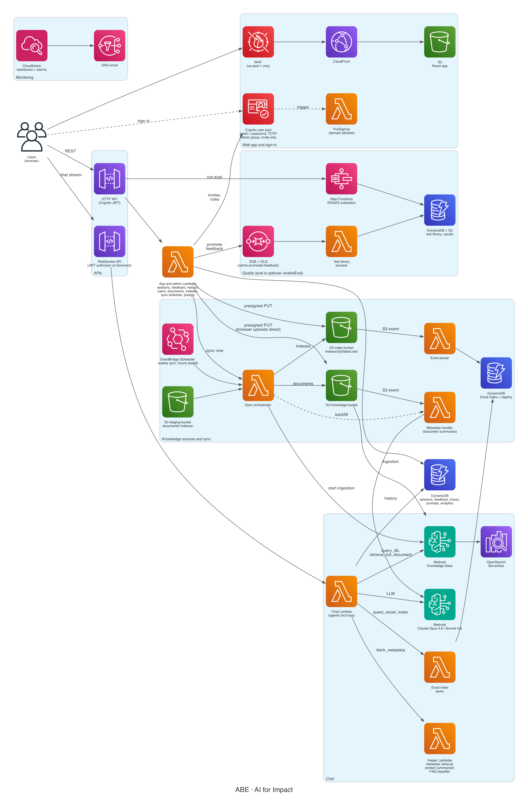

<p align="center">
  
</p>

<h1 align="center">ABE</h1>

<p align="center">
  An open-source, white-label AI assistant that answers questions from your documents and spreadsheets, with citations, on AWS.
</p>

<p align="center">
  <a href="LICENSE"></a>
  <a href="https://github.com/The-Burnes-Center/abe/actions/workflows/deploy.yml"></a>
  
  
  <a href="https://scorecard.dev/viewer/?uri=github.com/The-Burnes-Center/abe"></a>
</p>

<!-- DEMO:START -->
<p align="center">
  <a href="docs/media/abe-demo.mp4">
    
  </a>
  <br>
  <sub>22-second tour. Click the preview for the full-quality video with sound.</sub>
</p>
<!-- DEMO:END -->

## What it is

ABE is a chatbot you point at your own knowledge. You upload PDFs and other documents plus spreadsheets, and people ask questions in a chat window. ABE answers only from that material and shows which sources it used. You deploy it into your own AWS account with one CDK stack, and you rebrand it from a single file.

Key features:

- **Grounded answers with citations.** The assistant is instructed to answer only from retrieved material, cites its sources with numbered markers, and opens the source document from the citation.
- **Documents and spreadsheets.** PDFs and other documents go into an Amazon Bedrock Knowledge Base (hybrid semantic and keyword search over OpenSearch Serverless). `.xlsx` files become structured indexes in DynamoDB that the assistant can filter, count, group and sort.
- **An agentic tool loop.** The model decides which of four tools to call, reads the results, and repeats (up to 25 rounds per question by default) before it answers.
- **Streaming chat.** Answers stream over a WebSocket. Long conversations are compacted automatically, and users can stop a response mid-stream. Voice dictation uses Amazon Transcribe streaming.
- **An admin console.** Pages for data (documents, spreadsheet indexes, sync schedule), users (invite, promote, disable, delete), feedback review, analytics, and quality monitoring.
- **White-label branding from one file.** Names, colors, fonts, logos, timezone and starter prompts live in `config/brand.ts`.
- **Invite-only sign-in.** Amazon Cognito with email and password, optional authenticator-app (TOTP) codes, and an `Admin` group. Self sign-up is off unless you list allowed email domains.
- **RAGAS evaluations (behind a flag).** Upload test questions, run the full agent against each one, and score six metrics. Turn the whole pipeline off with `enableEval=false`.
- **Monitoring.** A CloudWatch dashboard (`<StackName>-Operations`) and 39 alarms (47 with the evaluation pipeline) that publish to an SNS topic.

## Architecture



The diagram is generated by `docs/generate_architecture.py`.

How a chat request flows:

1. The browser signs in with Cognito and receives an ID token. It opens a WebSocket to API Gateway, passing the token in the query string. A Lambda authorizer checks the signature, expiry and audience on the `$connect` route.
2. Each question arrives as a `getChatbotResponse` message and runs in the chat Lambda. The Lambda loads the live system prompt from DynamoDB, trims the history to the last 12 exchanges, and calls Claude on Bedrock with streaming.
3. When Claude asks for a tool, the Lambda runs it and feeds the result back. The four tools are:
   - `query_db`: hybrid search of the Knowledge Base (up to 2 pages of 25 results, at most 5 chunks per document). It accepts an optional `within_document` filter.
   - `retrieve_full_document`: every chunk of one document, found by file name (partial names match). It is capped at 5 pages of 100 chunks, 150 chunks and 120,000 characters, and says so when it cuts a document.
   - `fetch_metadata`: the document inventory (file names, tags and LLM-written summaries).
   - `query_excel_index`: structured queries (filters, counts, group-by, sorting, distinct values) against the spreadsheet indexes in DynamoDB. It is only offered when at least one index exists, and its description lists the live column names.
4. The final answer streams back with `[N]` citation markers, which the frontend resolves to source documents through a presign endpoint. The exchange is saved to the session history, a trace row is written, and a small Lambda classifies the question by topic for the analytics page.

Everything else (documents, users, feedback, sync, metrics) goes through an HTTP API protected by the Cognito JWT authorizer. Browsers upload files straight to S3 with short-lived presigned URLs, so file bytes never pass through a Lambda.

## Quick start

These steps take you from nothing to a working deployment in your own AWS account. The stack costs roughly $190 to $200 per month while idle, almost all of it OpenSearch Serverless (see [Costs](#costs)), so plan to tear it down if you are only trying it out.

### 1. Prerequisites

- An AWS account and credentials for it (for example `aws configure` or SSO). The identity needs permission to create IAM roles and the services in the stack. An administrator role is the simplest for the first deploy.
- Git and Node.js 22 (the repo pins it in `.nvmrc`; `nvm use` picks it up). Node.js 22 is in Maintenance LTS and gets security fixes until 30 April 2027, and the Lambda runtime the stack uses (`nodejs22.x`) is scheduled for deprecation on 30 April 2027. Plan a move to Node.js 24 (the current Active LTS) before then by changing `NODE_RUNTIME` in `lib/shared/lambda-defaults.ts` and `.nvmrc`.
- AWS CLI v2.
- AWS CDK v2. The repo depends on it, so `npx cdk` works without a global install.
- Docker, running, for every synth and deploy. CDK builds the Python Lambdas that have pip dependencies inside a container, and builds the evaluation image (skipped only when `enableEval=false`, but the Python bundling still needs Docker).
- Python 3.12 is optional, only for running the Python tests.

### 2. Choose a region

`us-east-1` is the region this project is tested in, and the only one where the CloudFront web application firewall (WAF) is created. The WAF must live in `us-east-1`, so in any other region the stack deploys without it and prints a synth warning. Everything else works in other regions where Bedrock, OpenSearch Serverless and the models below are available (Titan Text Embeddings V2, for example, is not offered in every region, so check the model's region list first).

```bash
export AWS_REGION=us-east-1
export AWS_DEFAULT_REGION=us-east-1
```

### 3. Check Bedrock model access

Bedrock no longer has a separate model access page for most models. Serverless foundation models are enabled by default, and the first call to a third-party model subscribes your account to it automatically through AWS Marketplace. The stack uses these models by default:

| Use | Model | ID the stack uses by default |
|-----|-------|------------------------------|
| Chat, evaluation judge, prompt rewriting | Claude Opus 4.6 | `us.anthropic.claude-opus-4-6-v1` |
| Titles, summaries, topic classification, context compaction | Claude Sonnet 4.6 | `us.anthropic.claude-sonnet-4-6` |
| Embeddings (Knowledge Base and evaluations) | Amazon Titan Text Embeddings V2 | `amazon.titan-embed-text-v2:0` |

Before the first chat, do this once with an administrator identity (not the stack's Lambda roles, which have no Marketplace permissions):

1. Make sure the identity has `aws-marketplace:Subscribe`, `aws-marketplace:Unsubscribe` and `aws-marketplace:ViewSubscriptions`, and that the account has a valid payment method.
2. Open each Claude model in the Bedrock console (model catalog, then the playground) in your region and send one message. Anthropic also requires a one-time use-case form (company name, website, intended users, use case) per account, or once at the management account of an AWS Organization. The console shows the form the first time you open a Claude model. You can also submit it with `aws bedrock put-use-case-for-model-access`.
3. If the first request still returns `AccessDeniedException`, wait a few minutes (the subscription can take up to 15 minutes to finish) and retry.

The `us.` prefix is a cross-region inference profile. The stack picks the prefix from its region: `us.` for `us-*`, `eu.` for `eu-*`, `apac.` for `ap-*`, and `global.` for every other region. The Bedrock model cards list only `us.`, `eu.`, `au.` and `global.` profiles for Opus 4.6, plus `jp.` for Sonnet 4.6, so in an `ap-*` region set `PRIMARY_MODEL_ID` and `FAST_MODEL_ID` yourself (for example `global.anthropic.claude-opus-4-6-v1` and `global.anthropic.claude-sonnet-4-6`). Override either model with those environment variables (see [Deployment settings](#deployment-settings)).

Bedrock lists Opus 4.6 and Sonnet 4.6 as active, with end of life no sooner than February 2027, and newer Claude models exist. To use one, set the two variables to its ID or inference profile ID.

### 4. Clone and install

```bash
git clone https://github.com/The-Burnes-Center/abe.git   # or your fork
cd abe
nvm use
npm ci
```

### 5. Bootstrap CDK and deploy

Bootstrap once per account and region. It creates the CDK toolkit stack that holds deployment assets:

```bash
npx cdk bootstrap aws://$(aws sts get-caller-identity --query Account --output text)/$AWS_REGION
```

Then deploy:

```bash
npx cdk deploy       # or: npm run deploy
```

`npm run deploy` runs the brand sync first and then `cdk deploy`. Docker must be running. The first deploy takes a while (plan for roughly 20 to 30 minutes), mostly OpenSearch Serverless, the Knowledge Base and the evaluation image. CDK prints stack outputs at the end, including `AppUrl`, `UserPoolId` and `UserPoolClientId`. List them again any time with:

```bash
aws cloudformation describe-stacks --stack-name ABEStack --query "Stacks[0].Outputs"
```

The stack is named `ABEStack` unless you set `STACK_NAME` (or change `slug` in `config/brand.ts`).

To change a deployment setting, add `-c name=value` to the command (for example `npx cdk deploy -c alarmEmail=you@example.org`) or export the matching environment variable. The full list is under [Deployment settings](#deployment-settings).

### 6. Create the first admin

Nobody can sign in until an admin is invited. Run:

```bash
scripts/create-admin.sh --email you@example.org
# optional: --stack-name ABEStack --region us-east-1
```

The script reads the `UserPoolId` output of the stack, creates the Cognito user with an emailed temporary password (valid 7 days), and adds the user to the `Admin` group. Run it again for an existing user to only ensure the group membership. The stack name defaults to `$STACK_NAME`, then `ABEStack`; the region defaults to `$AWS_REGION` or `$AWS_DEFAULT_REGION`, then your AWS CLI profile.

### 7. Sign in

Open the `AppUrl` output. Sign in with your email and the temporary password, then choose a new password (at least 12 characters with upper case, lower case, a digit and a symbol). To add an authenticator app, open the account menu in the header and choose **Two-step verification**.

### 8. Load your data

Sign in as an admin and open **Data** in the sidebar.

- **Documents** (PDFs and other files): upload on the **Documents** tab, then click **Sync data now**. Uploads go straight to the knowledge bucket, but the assistant cannot use them until a Knowledge Base ingestion job runs. The sync button starts one. Document summaries (used by the `fetch_metadata` tool) appear later: they need the ingested chunks, so an hourly backfill fills them in. A weekly sync also runs on Sundays at 1:00 AM in the brand timezone, and you can change that on the **Automation** tab.
- **Spreadsheets** (`.xlsx`): create an index on the **Data Indexes** tab and upload the file. The object lands at `indexes/{index_id}/latest.xlsx` in the index bucket, and an S3 event parses it into DynamoDB with no sync needed. Uploading an `.xlsx` to the knowledge bucket does not create an index: the two pipelines are separate.
- **Bulk or scripted loads**: copy files into the staging bucket under `documents/` and `indexes/{index_id}/latest.xlsx`, then run a sync. The details are in [docs/data-ingestion-s3-and-sync.md](docs/data-ingestion-s3-and-sync.md).

Then ask a question in the chat.

## Configuration

### Branding

Everything brand-related is in [`config/brand.ts`](config/brand.ts). The fields:

| Field | What it controls |
|-------|------------------|
| `slug` | Lowercase id. Drives the default stack name (`ABEStack`), the prompt registry family (`ABE_CHAT`), the CloudWatch metric namespace (`ABE/Chat`) and the `Project` tag. Changing it on a live deployment creates a different stack. |
| `assistantName`, `shortName` | Display name, and the short form for avatars, the input placeholder, tab titles and the mobile header |
| `organizationName`, `parentOrg` | Shown in the UI and in the system prompt |
| `tagline`, `welcomeMessage`, `suggestedPrompts` | Meta description, empty-chat greeting, starter prompt chips |
| `supportContact` | Where the assistant sends users when it has no answer |
| `domainContext` | Extra text injected into the system prompt (empty means generic) |
| `timezone` | IANA zone for the weekly sync schedule and for dates in the UI and the prompt (default `America/New_York`) |
| `palette`, `colorsLight`, `colorsDark` | Theme colors for light and dark mode |
| `fontFamily`, `fontUrl` | UI font stack and its web-font stylesheet |
| `assets` | Logo, dark-mode logo, favicon, icon (under `lib/user-interface/app/public/images/`) and an optional demo clip |
| `themeColorLight`, `themeColorDark` | Browser `theme-color` meta values |

Steps to rebrand a fork:

1. Edit `config/brand.ts` and replace the logo files in `lib/user-interface/app/public/images/`.
2. Run `npm run brand:sync`. It regenerates `lib/user-interface/app/src/common/brand.ts` and `public/manifest.json`.
3. Commit the regenerated files. The deploy workflow runs the sync again, but only to apply any brand Variables you set in the repository (see below). With none set, the committed files are what ships.

These environment variables override fields at sync and deploy time, which lets one build serve several brands: `BRAND_SLUG`, `ASSISTANT_NAME`, `SHORT_NAME`, `ORGANIZATION_NAME`, `PARENT_ORG`, `BRAND_TAGLINE`, `WELCOME_MESSAGE`, `SUPPORT_CONTACT`, `DOMAIN_CONTEXT`, `BRAND_TIMEZONE`, `BRAND_DEMO_VIDEO`. The deploy workflow runs `npm run brand:sync` after exporting the brand Variables you set, so a CI deployment can brand itself without a commit. Local `npm run deploy` also syncs first, but a plain `npx cdk deploy` does not, so run `npm run brand:sync` yourself after editing `config/brand.ts`.

The default brand shows the AI for Impact name and logos. They belong to AI for Impact. If you fork the project for your own deployment, replace them through `config/brand.ts`.

### Deployment settings

Each setting is read from CDK context (`-c name=value`) first, then from the environment variable in the second column. In GitHub Actions they come from repository Variables and Secrets (see [CI/CD](#cicd-with-github-actions)). Source: `lib/deployment-config.ts`, `lib/constants.ts`, `lib/shared/bedrock.ts`, `lib/abe-stack.ts`.

| Context key | Env var | Default | Effect |
|-------------|---------|---------|--------|
| `allowedSignupDomains` | `ALLOWED_SIGNUP_DOMAINS` | none | Comma-separated email domains. Non-empty turns on self sign-up for those domains (enforced by the PreSignUp trigger). Empty means invite-only. |
| `cognitoFeaturePlan` | `COGNITO_FEATURE_PLAN` | `ESSENTIALS` | `PLUS` adds Cognito threat protection at a higher per-user price. |
| `enableEval` | `ENABLE_EVAL` | `true` | `false` removes the evaluation pipeline: its Lambdas, Step Functions state machine, Docker image, two buckets, three tables, the SQS queues, the eval routes and the Quality Monitoring page. |
| `kbParserModel` | `KB_PARSER_MODEL` | unset | Model or inference-profile ID for foundation-model document parsing (for example `us.anthropic.claude-sonnet-4-6`). Unset uses Bedrock's default text parser. Setting it renders PDF pages as images so tables and checkbox state survive, costs more at ingestion, and replaces the data source (run a sync afterwards). |
| `apiGatewayAccountRole` | `API_GATEWAY_ACCOUNT_ROLE` | `true` | Manage the region-wide API Gateway CloudWatch Logs role. Set `false` for a second stack in the same account and region. |
| `metadataHandlerConcurrency` | `METADATA_HANDLER_CONCURRENCY` | unset | Reserved concurrency cap for the summary Lambda, so bulk syncs drain gradually instead of tripping Bedrock throttles. Leave unset in accounts whose total Lambda quota is still 10. |
| `devCorsOrigins` | `DEV_CORS_ORIGINS` | none | Extra CORS origins for the HTTP API and buckets, so `npm run dev` can call a deployed backend. Only `http://localhost` and `http://127.0.0.1` origins are accepted. |
| `alarmEmail` | `ALARM_EMAIL` | none | Subscribes this address to the alarm SNS topic. Confirm the subscription email AWS sends. |
| `customDomain` | `CUSTOM_DOMAIN` | none | Hostname for the site. Binds only when `certificateArn` is also set. See [docs/custom-domain.md](docs/custom-domain.md). |
| `certificateArn` | `CERTIFICATE_ARN` | none | ARN of an ACM certificate for that hostname, in `us-east-1` (a CloudFront requirement). |
| n/a | `STACK_NAME` | `ABEStack` (brand slug upper-cased + `Stack`) | CloudFormation stack name. Set it to run a second copy, such as staging, in one account. |
| n/a | `ENVIRONMENT` | `dev` | Value of the `Environment` resource tag. |
| n/a | `PRIMARY_MODEL_ID` | `<prefix>anthropic.claude-opus-4-6-v1` | Chat, evaluation judge and prompt-rewrite model. Accepts a model ID or an inference profile ID. |
| n/a | `FAST_MODEL_ID` | `<prefix>anthropic.claude-sonnet-4-6` | Titles, summaries, topic classification, context compaction, feedback analysis. |
| n/a | `GUARDRAIL_ID` | unset (guardrails off) | Bedrock Guardrail ID applied to chat and evaluation model calls. |
| n/a | `GUARDRAIL_VERSION` | `1` | Version of that guardrail. |

Derived values (not settings):

- `METRICS_NAMESPACE` on the chat Lambda is `<SLUG>/Chat` (for example `ABE/Chat`), from the brand slug. Evaluation metrics use `<SLUG>/Eval`.
- The Lambda environment also receives the brand values (`ASSISTANT_NAME`, `ORGANIZATION_NAME`, `SUPPORT_CONTACT`, `DOMAIN_CONTEXT`, `BRAND_TIMEZONE`) from `config/brand.ts`.

Runtime-only variable: `MAX_TOOL_ROUNDS` caps tool rounds per question in the chat Lambda (default 25, a positive integer). The stack does not set it. To change it, set it on the chat Lambda (console or a one-line `addEnvironment` in `lib/chatbot-api/functions/functions.ts`).

### Customizing the system prompt

The prompt has three layers:

1. **The code default** in [`lib/chatbot-api/functions/websocket-chat/prompt.mjs`](lib/chatbot-api/functions/websocket-chat/prompt.mjs). It uses placeholders for the brand values (`{{assistant_name}}`, `{{organization}}`, `{{support_contact}}`, `{{domain_context}}`) and `{{current_date}}`. Edit this file to change the default for everyone.
2. **The prompt registry**, a DynamoDB table (`PromptRegistryTable`) keyed by prompt family (`<SLUG>_CHAT`) and version. A special `LIVE` row points at the version that is served. On each cold start the chat Lambda compares a SHA-256 hash of the code default with the stored `system-default` version and updates it when you deploy a new `prompt.mjs`. If the `LIVE` pointer references a version created by an admin, deploys leave it alone, so a deliberate edit survives a deploy.
3. **The admin prompt workspace**: **Feedback Manager** in the sidebar, then the **Instructions** tab. Admins create a version (optionally with AI suggestions based on selected feedback), edit it, publish it (this moves the `LIVE` pointer), or delete old versions. Changes apply without a deploy.

If the registry is unreachable, the chat Lambda serves the embedded default rather than failing. The evaluation pipeline reads the same `LIVE` prompt read-only, so evaluations test what users get.

## User management

- **Invite-only by default.** Users do not appear until an admin invites them. Cognito emails each invitee a temporary password that expires in 7 days.
- **Admin Users page** (**Users** in the sidebar, admins only): invite by email (optionally as an admin), promote or demote, disable and re-enable, resend an invitation, and delete. An admin cannot demote, disable or delete themselves. Disabling or demoting signs the user out everywhere. Tokens last 15 minutes, so access ends within that window.
- **The Admin group.** Admins are members of the Cognito group `Admin`. The API reads the `cognito:groups` claim from the token, and every admin API checks it (the match is exact). Users cannot change their own group.
- **Self sign-up by email domain.** Set `allowedSignupDomains` (for example `-c allowedSignupDomains=example.org,example.edu`). The login page then shows **Create account**. A PreSignUp Lambda rejects any other domain on the server, so the check cannot be bypassed by calling the Cognito API directly. Self-registered users confirm their email with a code and are never admins. The PreSignUp trigger is wired even with an empty list, which keeps the sign-up API closed.
- **Two-step verification.** Optional TOTP (authenticator app) only. There is no SMS and no phone number. Users enroll from the account menu.
- **Email limits.** The stack uses Cognito's default email sender, which is limited to 50 emails per day per AWS account (the count resets at 09:00 UTC; see the Cognito quotas page). Invitations, verification codes and password resets all count. Once you expect more than that, switch the user pool to Amazon SES by passing `email: cognito.UserPoolEmail.withSES({ fromEmail: ... })` to the user pool in `lib/authorization/index.ts`, verify the sender in SES and move SES out of its sandbox. Do this in code, not in the Cognito console, because the user pool is managed by CDK.

## CI/CD with GitHub Actions

Four workflows live in `.github/workflows/`:

| Workflow | Trigger | What it does |
|----------|---------|--------------|
| `test.yml` | Called by the other two | Typechecks the CDK app, runs the Jest, Vitest and pytest suites, and lints, typechecks and tests the frontend. Needs no AWS credentials and no Docker. |
| `pr-check.yml` | Pull requests to `main` | Runs `test.yml` with coverage. If `AWS_DIFF_ROLE_ARN` is set, also writes a `cdk diff` to the job summary. |
| `deploy.yml` | Push to `main`, or manual run | Runs `test.yml`, then (only if `AWS_ROLE_ARN` is set) syncs the brand files, bootstraps CDK, waits for the stack to settle, and runs `cdk deploy`. |
| `scorecard.yml` | Push to `main`, weekly, and branch protection changes | Runs the [OpenSSF Scorecard](https://scorecard.dev) supply-chain checks and uploads the results to code scanning. Needs no AWS credentials. |

**Deploy is skipped without `AWS_ROLE_ARN`.** A fork with no AWS configuration still gets the tests; the deploy job is simply skipped.

### Set up GitHub OIDC for deploys

1. In the AWS account, add an IAM identity provider: provider URL `https://token.actions.githubusercontent.com`, audience `sts.amazonaws.com`.
2. Create an IAM role with this trust policy (replace the account ID, owner and repo):

```json
{
  "Version": "2012-10-17",
  "Statement": [
    {
      "Effect": "Allow",
      "Principal": {
        "Federated": "arn:aws:iam::<ACCOUNT_ID>:oidc-provider/token.actions.githubusercontent.com"
      },
      "Action": "sts:AssumeRoleWithWebIdentity",
      "Condition": {
        "StringEquals": {
          "token.actions.githubusercontent.com:aud": "sts.amazonaws.com",
          "token.actions.githubusercontent.com:sub": "repo:<owner>/<repo>:ref:refs/heads/main"
        }
      }
    }
  ]
}
```

3. Give the role permission to deploy the stack. The simplest option is `AdministratorAccess` on a dedicated account. A narrower policy needs to cover CloudFormation, IAM role creation, and every service in the stack, plus assuming the CDK bootstrap roles.
4. Save the role ARN as the repository secret `AWS_ROLE_ARN`.

The condition above limits the role to runs on the `main` branch of one repository (a push to `main` or a manual run of the workflow on `main`). Pull requests cannot assume it. If you later add a GitHub `environment:` to the deploy job, the `sub` claim becomes `repo:<owner>/<repo>:environment:<name>` and the condition must change to match.

### Optional read-only role for PR diffs

Create a second role with the same trust pattern, but allow `pull_request` runs by setting `token.actions.githubusercontent.com:sub` to `repo:<owner>/<repo>:pull_request`, and attach read-only permissions (CloudFormation describe and get access, plus read access to the CDK bootstrap resources). Save its ARN as the secret `AWS_DIFF_ROLE_ARN`. Pull requests from forks never receive secrets, so they skip the diff.

### Repository Secrets and Variables

Everything below is optional unless marked required. Unset values fall back to the defaults in [Deployment settings](#deployment-settings) and `config/brand.ts`.

| Name | Kind | Used by | Purpose |
|------|------|---------|---------|
| `AWS_ROLE_ARN` | Secret | deploy | Required to deploy. The OIDC role to assume. |
| `AWS_DIFF_ROLE_ARN` | Secret | pr-check | Read-only role for the PR `cdk diff` |
| `CERTIFICATE_ARN` | Secret | deploy, pr-check | ACM certificate ARN for the custom domain |
| `ALARM_EMAIL` | Secret | deploy | Alarm subscription address |
| `AWS_REGION` | Variable | deploy, pr-check | Deploy region (default `us-east-1`) |
| `STACK_NAME` | Variable | deploy, pr-check | Stack name (default `ABEStack`) |
| `CUSTOM_DOMAIN` | Variable | deploy, pr-check | Custom hostname |
| `ALLOWED_SIGNUP_DOMAINS` | Variable | deploy, pr-check | Self sign-up domain allowlist |
| `COGNITO_FEATURE_PLAN` | Variable | deploy, pr-check | `ESSENTIALS` or `PLUS` |
| `ENABLE_EVAL` | Variable | deploy, pr-check | `true` or `false` |
| `KB_PARSER_MODEL` | Variable | deploy, pr-check | Foundation-model parser |
| `API_GATEWAY_ACCOUNT_ROLE` | Variable | deploy, pr-check | `true` or `false` |
| `ENVIRONMENT` | Variable | deploy, pr-check | `Environment` tag value |
| `PRIMARY_MODEL_ID`, `FAST_MODEL_ID` | Variables | deploy, pr-check | Model overrides |
| `GUARDRAIL_ID`, `GUARDRAIL_VERSION` | Variables | deploy, pr-check | Bedrock Guardrail |
| `ASSISTANT_NAME`, `SHORT_NAME`, `ORGANIZATION_NAME`, `BRAND_TAGLINE`, `SUPPORT_CONTACT`, `DOMAIN_CONTEXT`, `BRAND_TIMEZONE` | Variables | deploy, pr-check | Brand overrides |

The workflows do not read `devCorsOrigins`, `METADATA_HANDLER_CONCURRENCY`, `PARENT_ORG`, `WELCOME_MESSAGE`, `BRAND_SLUG` or `BRAND_DEMO_VIDEO`. To use those in CI, add them to the "Export deployment settings" step of the workflows.

Each variable is a single line. The workflow rejects multi-line values.

## Local development

You can work on the frontend against a backend you have deployed.

```bash
cd lib/user-interface/app
npm install
cp .env.example .env     # fill in the values from your stack outputs (see below)
npm run dev              # http://localhost:3000
```

The stack outputs you need are `UserPoolId`, `UserPoolClientId`, `HTTP-API - apiEndpoint` and `WS-API - apiEndpoint`. `.env` holds `ABE_REGION`, `ABE_USER_POOL_ID`, `ABE_USER_POOL_CLIENT_ID`, `ABE_HTTP_ENDPOINT`, `ABE_WS_ENDPOINT` (the WebSocket endpoint plus the `/prod` stage), `ABE_SELF_SIGNUP_ENABLED` and `ABE_EVAL_ENABLED`. The dev server turns them into `/aws-exports.json`, the same file the deployed site fetches. The app README ([`lib/user-interface/app/README.md`](lib/user-interface/app/README.md)) has the full table.

The deployed API only accepts the site's own origin, so for `http://localhost:3000` redeploy the stack with the dev origin allowed:

```bash
npx cdk deploy -c devCorsOrigins=http://localhost:3000
```

Otherwise sign-in works but data requests fail with CORS errors. For backend changes, deploy your own stack and iterate with `npx cdk deploy`.

## Testing

From the repo root:

```bash
npm test                 # CDK stack tests (Jest). Synthesize without Docker.
npx tsc --noEmit         # typecheck the CDK app
npm run test:lambda      # Node Lambda tests (Vitest)

# Python Lambda tests (Python 3.12)
python3 -m pip install pytest pytest-cov "moto[cognitoidp]" boto3 pydantic openpyxl "PyJWT[crypto]" cryptography opensearch-py
python3 -m pytest $(git ls-files 'lib/*test_*.py' | grep -E '/test_[^/]+\.py$')
```

From `lib/user-interface/app`:

```bash
npm run lint             # ESLint, zero warnings allowed
npx tsc --noEmit         # typecheck
npm test                 # Vitest + Testing Library (npm run test:coverage for coverage)
```

CI runs the same set on every pull request (`.github/workflows/test.yml`).

## Costs

These are rough estimates for an idle deployment in `us-east-1`, based on public list prices checked in October 2026. They change, so check the pricing pages before you commit: [OpenSearch Serverless](https://aws.amazon.com/opensearch-service/pricing/), [WAF](https://aws.amazon.com/waf/pricing/), [Cognito](https://aws.amazon.com/cognito/pricing/), [CloudWatch](https://aws.amazon.com/cloudwatch/pricing/), [Bedrock](https://aws.amazon.com/bedrock/pricing/), [Transcribe](https://aws.amazon.com/transcribe/pricing/).

| Item | Estimated monthly cost | Notes |
|------|------------------------|-------|
| OpenSearch Serverless | about $175 and up | The dominant fixed cost. The collection is created with standby replicas disabled (the cheaper dev and test layout), which allows a minimum of 0.5 OCU for indexing plus 0.5 OCU for search, 1 OCU in total. At $0.24 per OCU-hour that is about $175 per month (730 hours), plus $0.02 per GB-month of storage. With standby replicas on, the minimum is 2 OCUs (about $350). It grows with data and traffic, and it bills whether or not anyone chats. Vector search collections do not share OCUs with other collection types. AWS also offers a NextGen generation that scales to zero, but it is created through collection groups and this stack does not use it. |
| WAF | about $9 plus $0.60 per million requests | One web ACL at $5 per month and four rules (three AWS managed rule groups and the rate limit) at $1 each. Created only in `us-east-1`. |
| CloudWatch | about $4 to $8 | Alarms are $0.10 each per month (39, or 47 with evals, so $3.90 or $4.70 before the 10 free alarm metrics). The dashboard is $3 per month beyond the 3 free dashboards per account. Logs cost $0.50 per GB ingested after the first 5 GB (kept 1 month). |
| Cognito | $0 up to 10,000 monthly active users on Essentials | Essentials is $0.015 per monthly active user above that. `PLUS` (`cognitoFeaturePlan=PLUS`) is $0.02 per monthly active user with no free tier. |
| DynamoDB, S3, Lambda, API Gateway, CloudFront | usually under $10 at low traffic | All pay-per-use. DynamoDB is on-demand with point-in-time recovery on. |
| Bedrock | per token | Scales with usage. Prompt caching cuts repeated system-prompt cost. Claude Opus is the most expensive component per question, so check the per-token prices for your models. |
| Knowledge Base ingestion | pennies per sync for text | Titan embeddings are cheap. `kbParserModel` adds a model call per page. |
| Voice dictation | per second of audio | Amazon Transcribe streaming. |
| Evaluation runs | a few dollars to tens of dollars per run | Each question runs the full agent with Opus, then six RAGAS metrics judged by Opus. Cost grows with question count. |

Baseline with no traffic: roughly $190 to $200 per month, nearly all of it OpenSearch Serverless. To cut it while you are not using a deployment, tear the stack down (see [Teardown](#teardown)).

## Security model

- **Authentication.** Cognito email and password with SRP (the password never leaves the browser), optional TOTP, minimum password length 12 with all four character classes, and no user-existence errors. ID and access tokens last 15 minutes, refresh tokens 30 days, and token revocation is on. The user pool is retained on stack deletion and has deletion protection.
- **API protection.** The HTTP API requires a valid Cognito JWT on every route. The WebSocket API authorizes on `$connect` (token in the query string) and derives the user's identity from it, never from message bodies. Admin routes also check the `Admin` group inside each Lambda and return 403 to everyone else. The user-admin API cannot be used to lock out the calling admin.
- **Network edge.** CloudFront serves the site over HTTPS with HSTS, no-sniff, frame denial and a referrer policy. A Content Security Policy is sent in report-only mode. In `us-east-1` a WAF adds AWS managed rule groups (common rules, IP reputation, known bad inputs) and a rate limit of 1,000 requests per IP per 5 minutes. API stages throttle at 100 requests per second with a burst of 50.
- **Data stores.** All S3 buckets block public access and require TLS. Documents are reachable only through IAM-scoped Lambdas or short-lived presigned URLs. The OpenSearch collection allows public network access (Bedrock reaches it from AWS-managed infrastructure) but its data access policy lists only the Knowledge Base role and the index-creation role.
- **Admin-controlled content.** Admin file uploads are limited to a safe file-name character set and cannot overwrite `metadata.txt` or `indexes/` keys.
- **Data retention.** Nothing is deleted automatically. All DynamoDB tables and data buckets are `RETAIN` (they survive `cdk destroy`) and DynamoDB point-in-time recovery is on. Chat history stays in the session table until a user deletes the session, and every answered question is stored with its answer, sources, prompt version, model and user ID in the response trace table. The analytics table holds the first 500 characters of each question with the user's identity. Only sync history (90 days) and short-lived disconnect markers expire on their own. Decide whether this fits your privacy obligations before you give access to the public.
- **What is logged.** Lambda logs go to CloudWatch for one month with structured JSON. API stages log access (request ID, source IP, route, status), not request bodies. Admin user actions write audit lines. X-Ray tracing is on for the Lambdas.
- **Reporting a vulnerability.** See [SECURITY.md](SECURITY.md). Use GitHub private vulnerability reporting, not a public issue.

## Teardown

```bash
npx cdk destroy
```

This deletes the stack's compute and the expensive pieces (OpenSearch Serverless collection, Knowledge Base, Lambdas, APIs, CloudFront, WAF, alarms, website buckets). It deliberately leaves your data behind:

| Left behind (RETAIN) | Count |
|----------------------|-------|
| DynamoDB tables (chat history, feedback, traces, prompts, analytics, index data, sync history) | 10, plus 3 evaluation tables when `enableEval` was on |
| S3 data buckets (knowledge source, knowledge supplemental, feedback exports, contract index, staging) | 5, plus 2 evaluation buckets when `enableEval` was on |
| SQS queues (feedback-to-test-library and its dead-letter queue) | 2, only when `enableEval` was on |
| Cognito user pool, with deletion protection on | 1 |

To clean up fully:

1. Find them by tag: `aws resourcegroupstaggingapi get-resources --tag-filters Key=Project,Values=abe` (use your brand slug). Tags are `Project`, `Environment` and `ManagedBy`.
2. Empty the retained S3 buckets, including old object versions (the knowledge, feedback and evaluation buckets are versioned), then delete them.
3. Delete the DynamoDB tables and SQS queues.
4. Turn off deletion protection on the user pool (Cognito console, user pool settings), then delete it.
5. The CDK bootstrap stack and its assets bucket stay until you remove them. They are shared by other CDK apps in the account and region.

A later redeploy with the same name creates fresh tables and buckets (their names are generated), so leftovers do not block it.

## Troubleshooting

| Symptom | Cause and fix |
|---------|---------------|
| `cdk synth` or `cdk deploy` fails with `Cannot connect to the Docker daemon` or an image build error | Docker is not running. Start Docker and retry. Docker is needed for every synth and deploy (Python bundling, and the eval image unless `enableEval=false`). |
| `This stack uses assets, so the toolkit stack must be deployed` or a missing `/cdk-bootstrap/...` SSM parameter | The account and region are not bootstrapped. Run the `cdk bootstrap` command from step 5 with the same credentials and region you deploy with. |
| Chat shows an error and the chat Lambda log has `AccessDeniedException` on `bedrock:InvokeModel...` | The account is not yet subscribed to the model (the Lambda role cannot subscribe, so do the one-time playground call from step 3), the Anthropic use-case form was not submitted, or the inference profile prefix does not match your region. Check the Bedrock console in the stack's region, then check `PRIMARY_MODEL_ID` and `FAST_MODEL_ID`. |
| Deploy fails creating the metadata Lambda: `decreases UnreservedConcurrentExecution below its minimum` | A new account has a low total Lambda concurrency quota. Do not set `metadataHandlerConcurrency` yet, and request a Lambda concurrency quota increase. The same quota can cause throttling during large syncs. |
| Deploy fails with `CloudWatch Logs role ARN must be set in account settings` or the API Gateway account role conflicts with another stack | One stack per account and region owns the API Gateway logging role. Deploy the second stack with `-c apiGatewayAccountRole=false`. |
| The synth prints `CloudFront WAF not created` | Expected outside `us-east-1`. The site works without the WAF. |
| The custom domain loads a spinner, or chat shows CORS errors | The domain was bound by hand and not through a deploy with `customDomain` and `certificateArn`. See [docs/custom-domain.md](docs/custom-domain.md). |
| Uploaded documents are not found by the assistant | The Knowledge Base only sees documents after an ingestion job. Click **Sync data now** on **Data**, then wait for it to finish. |
| A document has no summary, or the summary is empty | Summaries need ingested chunks and are generated by the hourly backfill. Wait up to an hour after ingestion completes. |
| A spreadsheet index stays empty | The file must be at `indexes/{index_id}/latest.xlsx` in the index bucket (the **Data Indexes** tab does this). Check the parser Lambda's log. |
| Invitation or verification emails do not arrive | Check spam. Cognito's default sender is limited to 50 emails per day per AWS account. Switch the user pool to SES (see [User management](#user-management)). |
| Sign-in succeeds but admin pages are missing | The user is not in the `Admin` group. Run `scripts/create-admin.sh --email <user>` or promote them on the Users page, then sign out and back in so the new token carries the group. |
| Stack is in `ROLLBACK_COMPLETE` after a failed first deploy | Delete the stack (`aws cloudformation delete-stack`), fix the cause shown in the CloudFormation events, and deploy again. |

## Project structure

```text
abe/
├── bin/abe.ts                      CDK app entry (cdk-nag checks attached)
├── config/brand.ts                 Brand identity (single source of truth)
├── lib/
│   ├── abe-stack.ts                Root stack: wires constructs, tags, nag suppressions
│   ├── deployment-config.ts        CDK context and env settings
│   ├── authorization/              Cognito user pool, PreSignUp trigger, WebSocket authorizer
│   ├── chatbot-api/
│   │   ├── functions/              All Lambdas (Node and Python), one directory each
│   │   │   ├── websocket-chat/     Chat handler and the agentic tool loop
│   │   │   ├── excel-index/        Spreadsheet parser, query engine and API
│   │   │   ├── step-functions/     Evaluation pipeline
│   │   │   └── layers/python-common/  Shared Python helpers
│   │   ├── tables/  buckets/       DynamoDB tables and S3 buckets
│   │   ├── knowledge-base/  opensearch/   Bedrock Knowledge Base, vector store
│   │   ├── gateway/                HTTP and WebSocket APIs
│   │   └── monitoring/             Dashboard and alarms
│   ├── shared/                     Lambda defaults, model IDs, naming helpers
│   └── user-interface/             CloudFront and S3 hosting, plus the React app in app/
├── scripts/                        create-admin.sh, sync-brand.ts
├── docs/                           Architecture diagram, custom domain, data ingestion
├── test/                           CDK stack tests
└── .github/workflows/              test, PR check, deploy, scorecard
```

## Contributing

Contributions are welcome. Read [CONTRIBUTING.md](CONTRIBUTING.md) for the dev setup, the branch and pull request flow (`main` is protected, so changes land through pull requests), and the tests every change needs. Follow the [Code of Conduct](CODE_OF_CONDUCT.md). `CLAUDE.md` holds the detailed architecture notes and conventions.

## Community and support

- **Questions and ideas:** [GitHub Discussions](https://github.com/The-Burnes-Center/abe/discussions). Issues are for confirmed bugs and planned work.
- **Getting help:** [SUPPORT.md](SUPPORT.md) says where to ask, what is out of scope and what response times to expect.
- **How the project is run:** [GOVERNANCE.md](GOVERNANCE.md) covers roles, decisions and releases, and [MAINTAINERS.md](MAINTAINERS.md) lists who to contact.
- **What changed:** [CHANGELOG.md](CHANGELOG.md) and the [GitHub Releases](https://github.com/The-Burnes-Center/abe/releases).
- **Contributing:** [CONTRIBUTING.md](CONTRIBUTING.md) and the [Code of Conduct](CODE_OF_CONDUCT.md).
- **Security:** [SECURITY.md](SECURITY.md). Report vulnerabilities privately, never in a public issue.

## License

[MIT](LICENSE). Copyright (c) 2024-2026 AI for Impact.

## Acknowledgements

ABE started from [aws-samples/aws-genai-llm-chatbot](https://github.com/aws-samples/aws-genai-llm-chatbot) (MIT-0) and has since been rewritten around Bedrock Knowledge Bases, an agentic tool loop and an admin console. It is built by AI for Impact.

The AI for Impact name and logos are the property of AI for Impact. Forks should replace them through `config/brand.ts`.
